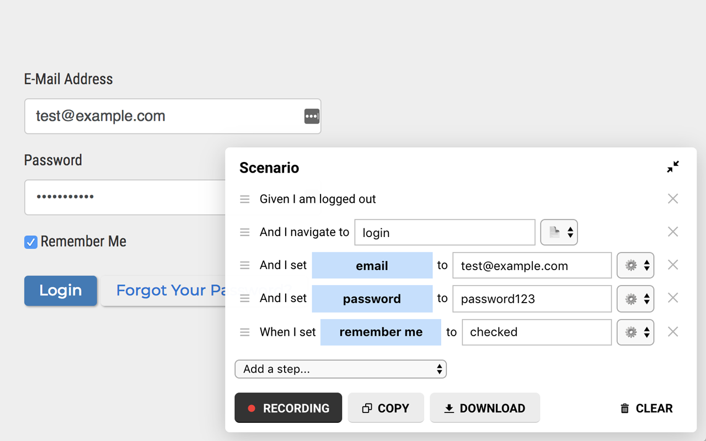
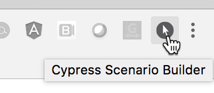
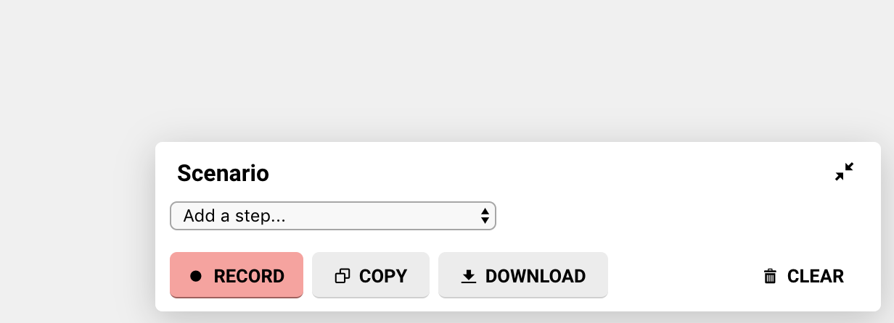

 Cypress Scenario Builder
===
This Chrome extension can record your behavior and automatically generate Gherkin-compatible given/when/then scenarios.




Example
---
Suppose we want to create a test scenario for unsuccessfully logging into a website. Simply start recording and perform the steps as a user would:


This scenario will be automatically generated based on the actions above:
```
Given I am logged out
And I navigate to "login"
And I set "email" to "foo@bar.com"
And I set "password" to "the wrong password"
And I set "remember me" to "checked"
When I click "login button"
Then "login error message" should be visible
```


How it works
---
When recording, this Chrome extension listens to user input (typing, clicking, selecting, etc.) and page navigation and will automatically generate the appropriate given/when/then step for those actions.

Element names are extracted from special HTML attributes that must be present on each actionable element. For example, the `email`, `password`, and `remember me` input elements from the previous example are identified by their corresponding `data-test` HTML attributes:

```html
<label>E-Mail Address</label>
<input name="email" type="email" data-test="email">

<label>Password</label>
<input name="password" type="password" data-test="password">

<label><input name="remember" type="checkbox" data-test="remember me"> Remember Me</label>
```

Page names are configured in the Chrome extension settings as a map of page names to URL paths. For example:
```js
{
  'login': '/login',
  'home': '/home',

  'projects': '/projects',
  'a project': new RegExp('/projects/d+$'),
  'create new project': '/projects/new',
}
```

All of these things are configurable. See later sections for more information.


Installation
---

### Installation from the Chrome Web Store (recommended)
On the Chrome Web Store: [Cypress Scenario Builder](https://chrome.google.com/webstore/detail/cypress-scenario-builder/bbmabgnlflpjhmljnfbjlddabipleapd)


### Manual installation
This option is useful if you want to fork this Git repository to make changes to the extension.

1. Clone this Git repository
2. Enable [developer mode](https://developer.chrome.com/extensions/faq#faq-dev-01) for Chrome extensions
3. Click "Load unpacked" and select the cloned Git directory from the file browser


Configuration
---
Coming soon.


Usage
---

### Turning on & off
This extension operates on a per-tab basis and is disabled until activated for a specific tab. Once activated for a tab, it will remain active across page navigation, refreshes, etc. until deactivated. To activate or deactivate the extension for the current tab, simply click the extension's icon in your Chrome toolbar:



Once activated, a floating panel will be visible in the lower right hand corner of the tab window:



The panel can be collapsed by clicking the collapse icon: 


### Adding steps
There are two ways of adding given/when/then scenario steps: automatically and manually.

#### Adding steps automatically
Steps can be automatically added by listening to your actions on the page. Click the _"Record"_ button and perform the user actions that you want to have recorded as steps in the scenario.

#### Adding steps manually
Coming soon.
